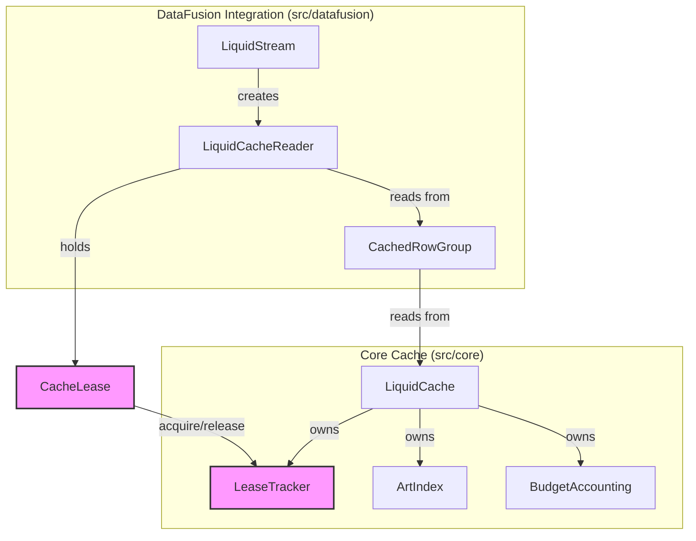
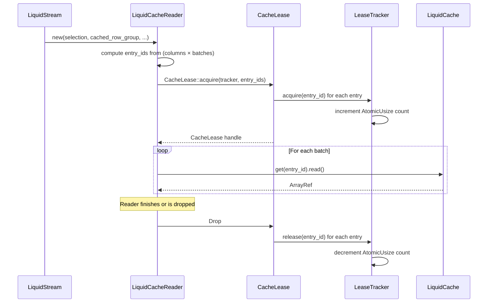
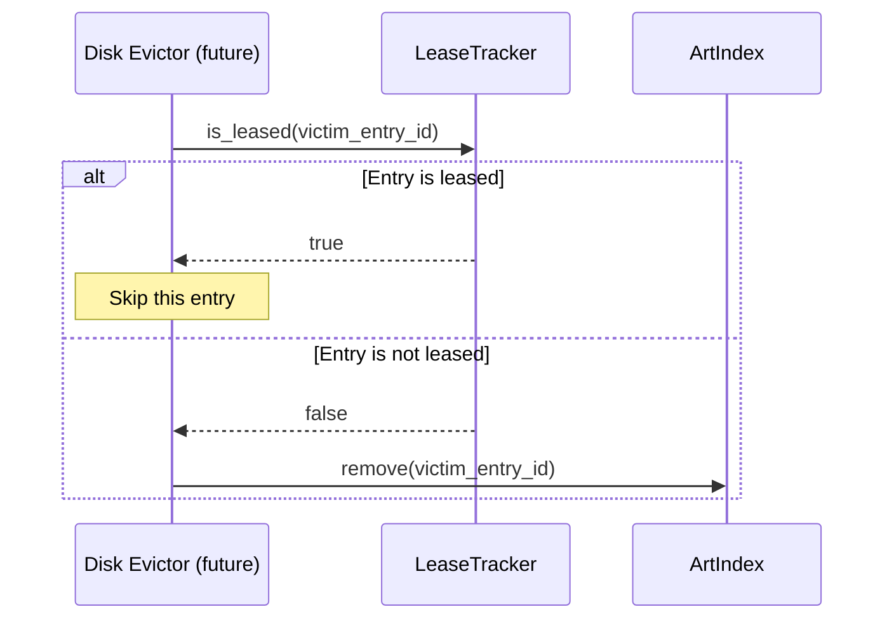

# Design Document: Lease-Based Cache Eviction

## Overview

LiquidCache currently has no mechanism to protect cache entries from being removed while a concurrent query is actively reading them. The read path has a two-phase contract per row group: first **FillCache** (fetch missing batches from Parquet into cache), then **ReadFromCache** (read everything from cache with no fallback). Once a query enters the ReadFromCache phase, it assumes all its batches exist in the cache index. Memory eviction (squeeze) is safe because it only *replaces* entries (`MemoryArrow` → `DiskLiquid`) — it never removes them. But future disk eviction must *remove* entries entirely, which would cause `index.get()` to return `None` mid-query.

This design introduces a **lease-based mechanism** that prevents disk eviction from removing cache entries that are actively being read. A `LeaseTracker` maintains per-entry reader counts, and a `CacheLease` RAII handle automatically releases leases when a reader finishes. This is a prerequisite for adding disk size limits to the cache — the lease infrastructure must exist before any eviction logic can safely remove entries.

The scope of this design is limited to the lease mechanism itself (LeaseTracker + CacheLease) and wiring it into `LiquidCacheReader`. Disk budget tracking, watermark-based eviction, and `IoContext::delete` are out of scope for this phase.

## Architecture



## Sequence Diagrams

### Lease Acquire and Release Flow



### Future Eviction Check (Not Implemented Yet)



## Components and Interfaces

### Component 1: LeaseTracker

**Purpose**: Thread-safe concurrent map tracking how many active readers hold each cache entry. Uses `RwLock<AHashMap<EntryID, AtomicUsize>>` consistent with the project's existing concurrency patterns.

```rust
use ahash::AHashMap;
use std::sync::atomic::{AtomicUsize, Ordering};

#[derive(Debug, Default)]
pub struct LeaseTracker {
    counts: RwLock<AHashMap<EntryID, AtomicUsize>>,
}
```

**Interface**:

```rust
impl LeaseTracker {
    /// Create a new empty lease tracker.
    pub fn new() -> Self;

    /// Increment the reader count for an entry.
    /// If the entry has no existing count, inserts it with count 1.
    pub fn acquire(&self, entry_id: &EntryID);

    /// Decrement the reader count for an entry.
    /// If the count reaches zero, removes the entry from the map.
    pub fn release(&self, entry_id: &EntryID);

    /// Returns true if any reader currently holds a lease on this entry.
    pub fn is_leased(&self, entry_id: &EntryID) -> bool;

    /// Returns the current reader count for an entry (0 if not tracked).
    /// Primarily for testing and diagnostics.
    pub fn lease_count(&self, entry_id: &EntryID) -> usize;
}
```

**Responsibilities**:
- Maintain per-entry reader counts with atomic operations
- Provide O(1) acquire, release, and is_leased checks
- Clean up zero-count entries to prevent unbounded map growth

### Component 2: CacheLease

**Purpose**: RAII handle held by a reader for its lifetime. Automatically releases all leased entries when dropped, even on panic unwind.

```rust
pub struct CacheLease {
    entries: Vec<EntryID>,
    tracker: Arc<LeaseTracker>,
}
```

**Interface**:

```rust
impl CacheLease {
    /// Acquire leases on all provided entry IDs.
    /// Each entry's reader count is incremented atomically.
    pub fn acquire(tracker: Arc<LeaseTracker>, entries: Vec<EntryID>) -> Self;

    /// Returns the entry IDs held by this lease.
    pub fn entries(&self) -> &[EntryID];

    /// Returns the number of entries held by this lease.
    pub fn len(&self) -> usize;

    /// Returns true if this lease holds no entries.
    pub fn is_empty(&self) -> bool;
}

impl Drop for CacheLease {
    fn drop(&mut self) {
        for entry_id in &self.entries {
            self.tracker.release(entry_id);
        }
    }
}
```

**Responsibilities**:
- Batch-acquire leases for all entries a reader will access
- Guarantee release on drop (RAII safety)
- Provide introspection for testing

### Component 3: LiquidCache (Modified)

**Purpose**: Add `lease_tracker` field to the existing `LiquidCache` struct so it can be shared with readers.

```rust
pub struct LiquidCache {
    index: ArtIndex,
    config: CacheConfig,
    budget: BudgetAccounting,
    cache_policy: Box<dyn CachePolicy>,
    hydration_policy: Box<dyn HydrationPolicy>,
    squeeze_policy: Box<dyn SqueezePolicy>,
    observer: Arc<Observer>,
    io_context: Arc<dyn IoContext>,
    lease_tracker: Arc<LeaseTracker>,  // NEW
}
```

**New method**:

```rust
impl LiquidCache {
    /// Get a reference to the lease tracker.
    pub fn lease_tracker(&self) -> &Arc<LeaseTracker> {
        &self.lease_tracker
    }
}
```

### Component 4: CachedRowGroup (Modified)

**Purpose**: Expose the lease tracker to readers through the row group handle.

```rust
impl CachedRowGroup {
    /// Get the lease tracker from the underlying cache store.
    pub fn lease_tracker(&self) -> &Arc<LeaseTracker> {
        self.cache_store.lease_tracker()
    }
}
```

### Component 5: LiquidCacheReader (Modified)

**Purpose**: Acquire a lease on construction covering all (column × batch) entries the reader will access. The lease is held for the reader's lifetime and released on drop.

```rust
pub(crate) struct LiquidCacheReader {
    state: ReaderState,
    row_filter: Option<LiquidRowFilter>,
    _lease: CacheLease,  // NEW — held for reader's lifetime
}
```

## Data Models

### EntryID (Existing)

```rust
#[derive(Debug, Clone, Copy, PartialEq, Eq, Hash, Ord, PartialOrd)]
pub struct EntryID {
    val: usize,
}
```

EntryID uniquely identifies a cache entry as a combination of (file_id, row_group_id, column_id, batch_id). The `ColumnAccessPath` and `ParquetArrayID` types in the datafusion layer compose these into an EntryID.

### LeaseTracker Internal State

The `RwLock<AHashMap<EntryID, AtomicUsize>>` maps each leased entry to its active reader count. Entries with zero readers are removed to prevent unbounded growth. The `RwLock` is consistent with the project's existing concurrency patterns (see `sync` module which provides shuttle-compatible primitives).

**Invariants**:
- All values in the map are > 0 (zero-count entries are removed on release)
- `acquire` always increments; `release` always decrements
- The count for an entry equals the number of `CacheLease` instances that include it

## Key Functions with Formal Specifications

### Function: LeaseTracker::acquire

```rust
pub fn acquire(&self, entry_id: &EntryID)
```

**Preconditions:**
- `entry_id` is a valid EntryID

**Postconditions:**
- `self.lease_count(entry_id) == old_count + 1`
- If entry was not previously tracked, it is now tracked with count 1
- No other entry's count is modified

### Function: LeaseTracker::release

```rust
pub fn release(&self, entry_id: &EntryID)
```

**Preconditions:**
- `self.lease_count(entry_id) > 0` (caller must have previously acquired)

**Postconditions:**
- If `old_count > 1`: `self.lease_count(entry_id) == old_count - 1`
- If `old_count == 1`: entry is removed from the map, `self.lease_count(entry_id) == 0`
- No other entry's count is modified

### Function: LeaseTracker::is_leased

```rust
pub fn is_leased(&self, entry_id: &EntryID) -> bool
```

**Preconditions:**
- None

**Postconditions:**
- Returns `true` if and only if `self.lease_count(entry_id) > 0`
- No side effects

### Function: CacheLease::acquire

```rust
pub fn acquire(tracker: Arc<LeaseTracker>, entries: Vec<EntryID>) -> Self
```

**Preconditions:**
- `tracker` is a valid Arc<LeaseTracker>
- `entries` may contain duplicates (same entry leased multiple times is valid)

**Postconditions:**
- For each entry_id in entries: `tracker.lease_count(entry_id)` increased by the number of occurrences of entry_id in entries
- Returned CacheLease holds all entries

### Function: CacheLease::drop

**Preconditions:**
- The CacheLease was previously constructed via `acquire`

**Postconditions:**
- For each entry_id in self.entries: `tracker.lease_count(entry_id)` decreased by the number of occurrences
- If any entry's count reaches 0, it is removed from the tracker

**Loop Invariants:**
- After processing entries[0..i], exactly i releases have been performed

### Function: compute_lease_entry_ids

```rust
fn compute_lease_entry_ids(
    selection: &RowSelection,
    batch_size: usize,
    row_count: usize,
    cached_row_group: &CachedRowGroupRef,
    projection_columns: &[usize],
) -> Vec<EntryID>
```

**Preconditions:**
- `batch_size > 0`
- `projection_columns` contains valid column indices for the row group

**Postconditions:**
- Returns the Cartesian product of (selected batches × projection columns) as EntryIDs
- Each EntryID corresponds to a (column, batch) pair the reader will access
- No duplicates in the output

## Example Usage

```rust
use std::sync::Arc;

// --- LeaseTracker standalone usage ---
let tracker = Arc::new(LeaseTracker::new());
let entry_a = EntryID::from(42);
let entry_b = EntryID::from(99);

// No leases initially
assert!(!tracker.is_leased(&entry_a));
assert_eq!(tracker.lease_count(&entry_a), 0);

// Acquire via RAII handle
let lease = CacheLease::acquire(Arc::clone(&tracker), vec![entry_a, entry_b]);
assert!(tracker.is_leased(&entry_a));
assert!(tracker.is_leased(&entry_b));
assert_eq!(tracker.lease_count(&entry_a), 1);

// Second reader on same entry
let lease2 = CacheLease::acquire(Arc::clone(&tracker), vec![entry_a]);
assert_eq!(tracker.lease_count(&entry_a), 2);

// Drop first lease — entry_a still leased by lease2
drop(lease);
assert!(tracker.is_leased(&entry_a));
assert!(!tracker.is_leased(&entry_b));
assert_eq!(tracker.lease_count(&entry_a), 1);

// Drop second lease — fully released
drop(lease2);
assert!(!tracker.is_leased(&entry_a));

// --- Integration in LiquidCacheReader ---
// (Inside LiquidCacheReader::new)
let entry_ids = compute_lease_entry_ids(
    &selection, batch_size, row_count, &cached_row_group, &projection_columns
);
let lease = CacheLease::acquire(
    Arc::clone(cached_row_group.lease_tracker()),
    entry_ids,
);
// lease is stored as `_lease` field, released when reader is dropped
```

## Correctness Properties

1. **Lease safety**: For all entries E and all time intervals T where a `CacheLease` holding E exists, `tracker.is_leased(E)` returns `true`. This is the core safety property that future disk eviction depends on.

2. **RAII release guarantee**: For all `CacheLease` instances L, when L is dropped (including on panic unwind), every entry in L.entries has its lease count decremented exactly once.

3. **Count accuracy**: For all entries E, `tracker.lease_count(E)` equals the number of live `CacheLease` instances that contain E in their entries vector.

4. **No leaked leases**: After all `CacheLease` instances are dropped, `tracker.is_leased(E)` returns `false` for all entries E.

5. **Concurrent correctness**: Multiple threads can concurrently acquire and release leases on the same entry without data races or lost updates.

6. **Zero-count cleanup**: If `tracker.lease_count(E) == 0`, then E is not present as a key in the internal map (prevents unbounded growth).

7. **Reader coverage**: The set of EntryIDs in a `LiquidCacheReader`'s lease is a superset of all EntryIDs that the reader will access during its lifetime.

## Error Handling

### Error Scenario 1: Release without acquire

**Condition**: Calling `release` on an entry that has no active leases (count is 0 or entry not in map).
**Response**: This is a programming error. The release is a no-op (the entry is simply not in the map). In debug builds, a `debug_assert!` fires to catch the bug early.
**Recovery**: No recovery needed — this indicates a bug in lease management.

### Error Scenario 2: Reader panic mid-read

**Condition**: A `LiquidCacheReader` panics while processing batches.
**Response**: Rust's drop semantics guarantee that `CacheLease::drop` runs during panic unwind, releasing all leases.
**Recovery**: Automatic via RAII.

### Error Scenario 3: Duplicate entries in lease

**Condition**: The same EntryID appears multiple times in the entries vector passed to `CacheLease::acquire`.
**Response**: Each occurrence increments the count separately, and each is released separately on drop. The net effect is zero — counts return to their original values.
**Recovery**: Not an error condition, but `compute_lease_entry_ids` should produce deduplicated lists for efficiency.

## Testing Strategy

### Unit Testing Approach

- **LeaseTracker**: Test acquire/release/is_leased in isolation. Verify count accuracy, zero-count cleanup, and idempotent behavior.
- **CacheLease**: Test RAII release on normal drop and on simulated panic. Verify multi-entry leases release all entries.
- **Integration**: Test that `LiquidCacheReader` acquires leases covering the correct entries and releases them when the reader completes or is dropped early.

### Concurrency Testing

- Multiple threads acquiring and releasing leases on overlapping entries simultaneously.
- Verify that after all threads complete, all lease counts return to zero.
- Use the project's existing shuttle-based concurrency testing infrastructure where applicable.

### Property-Based Testing Approach

**Property Test Library**: proptest (consistent with Rust ecosystem)

- **Acquire-release symmetry**: For any sequence of acquire/release operations, the final count for each entry equals (total acquires - total releases) for that entry.
- **RAII completeness**: Creating N CacheLease instances and dropping them all results in all entries having count 0.

## Dependencies

- No new external dependencies. The implementation uses `RwLock<AHashMap<...>>` (already available via `ahash` and the project's `sync` module), `Arc`, `AtomicUsize`, and `Drop` from `std`.
