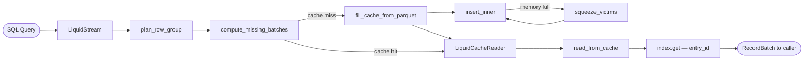
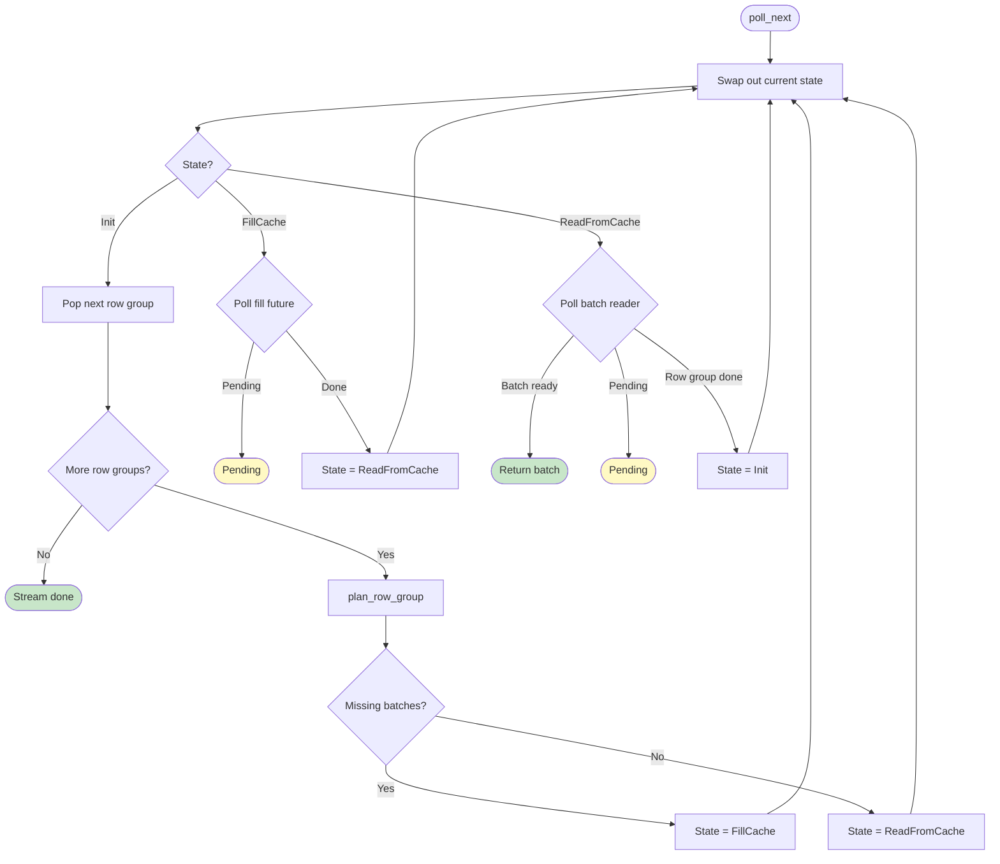
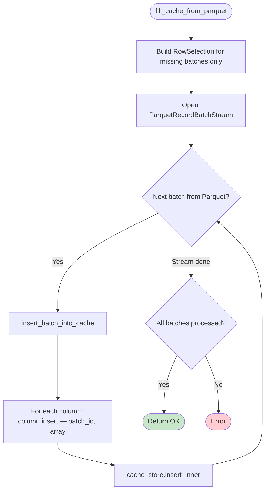
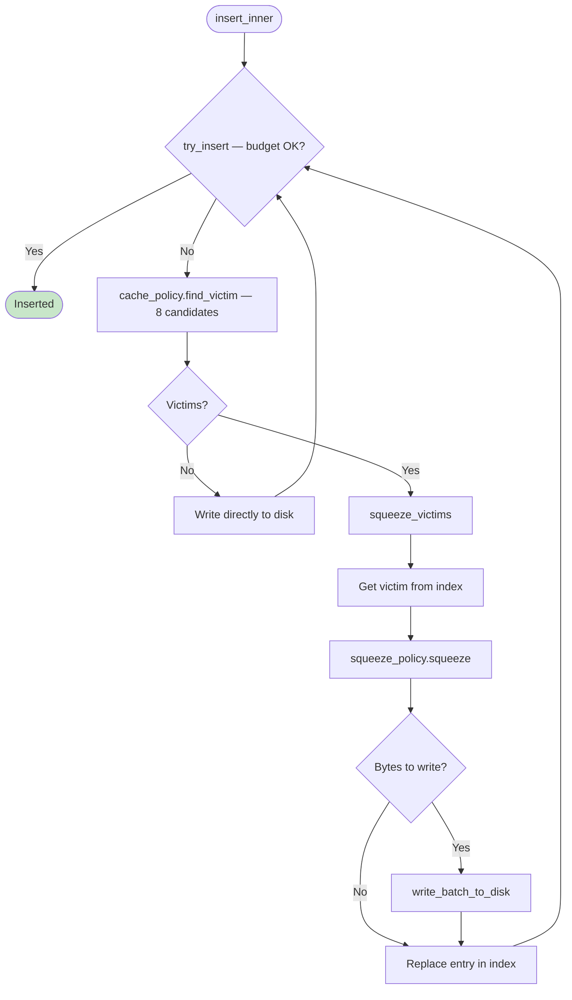
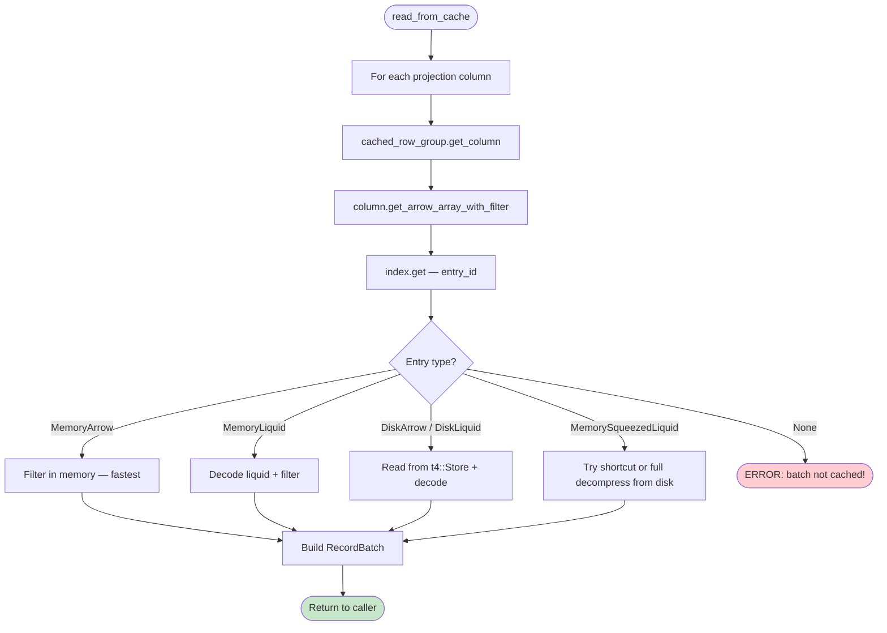

# LiquidCache — Current Read Path Documentation

## End-to-End Flow Overview



---

## Step 1: LiquidStream State Machine

The entry point for all cache reads. It's an async `Stream` that produces `RecordBatch`es one at a time. Internally it's a state machine with three states:

```
Init ──→ FillCache ──→ ReadFromCache ──→ Init (next row group)
  │                                         │
  └── (all cached) ──→ ReadFromCache ───────┘
```

### Code: `src/datafusion/src/reader/runtime/liquid_stream.rs`

```rust
impl Stream for LiquidStream {
    type Item = Result<RecordBatch, ParquetError>;

    fn poll_next(mut self: Pin<&mut Self>, cx: &mut Context<'_>) -> Poll<Option<Self::Item>> {
        loop {
            let state = std::mem::replace(&mut self.state, StreamState::Init);

            match state {
                // STATE 1: Reading batches from cache
                StreamState::ReadFromCache(mut batch_reader) => {
                    match Pin::new(&mut batch_reader).poll_next(cx) {
                        Poll::Ready(Some(Ok(batch))) => {
                            // Got a batch — return it to caller
                            self.state = StreamState::ReadFromCache(batch_reader);
                            return Poll::Ready(Some(Ok(batch)));
                        }
                        Poll::Ready(None) => {
                            // Row group done — save filter, go back to Init for next row group
                            let filter = batch_reader.into_filter();
                            self.reader.as_mut().unwrap().filter = filter;
                        }
                        Poll::Pending => {
                            self.state = StreamState::ReadFromCache(batch_reader);
                            return Poll::Pending;
                        }
                        Poll::Ready(Some(Err(e))) => panic!("Decoding error: {e:?}"),
                    }
                }

                // STATE 2: Starting a new row group
                StreamState::Init => {
                    let row_group_idx = match self.row_groups.pop_front() {
                        Some(idx) => idx,
                        None => return Poll::Ready(None), // no more row groups — stream done
                    };

                    // Plan what's cached vs missing
                    let maybe_context = self.reader.as_mut().unwrap().plan_row_group(...);

                    match maybe_context {
                        Some(context) => {
                            if !context.missing_batches.is_empty() {
                                // CACHE MISS — need to fetch from Parquet first
                                let fut = reader.fill_cache_from_parquet(context).boxed();
                                self.state = StreamState::FillCache(fut);
                            } else {
                                // CACHE HIT — everything already cached, read directly
                                let batch_reader = LiquidCacheReader::new(...);
                                self.state = StreamState::ReadFromCache(batch_reader);
                            }
                        }
                        None => { /* skip this row group, loop back to Init */ }
                    }
                }

                // STATE 3: Filling cache from Parquet
                StreamState::FillCache(mut f) => match f.as_mut().poll(cx) {
                    Poll::Pending => {
                        self.state = StreamState::FillCache(f);
                        return Poll::Pending;
                    }
                    Poll::Ready(Ok((reader_factory, context))) => {
                        // Fill done — now read from cache (NO fallback to Parquet)
                        let batch_reader = LiquidCacheReader::new(...);
                        self.state = StreamState::ReadFromCache(batch_reader);
                    }
                    Poll::Ready(Err(e)) => panic!("Filling cache error: {e:?}"),
                },
            }
        }
    }
}
```

### Flowchart



---

## Step 2: Detecting Cache Misses

`compute_missing_batches` checks which batches need to be fetched from Parquet. A batch is "missing" if ANY column doesn't have it cached.

### Code: `src/datafusion/src/reader/runtime/liquid_stream.rs`

```rust
fn compute_missing_batches(
    cached_row_group: &CachedRowGroupRef,
    column_ids: &[usize],
    selection_batches: &[BatchID],
) -> Vec<BatchID> {
    if column_ids.is_empty() || selection_batches.is_empty() {
        return Vec::new();
    }

    let mut columns = Vec::with_capacity(column_ids.len());
    for &column_idx in column_ids {
        columns.push(cached_row_group.get_column(column_idx as u64));
    }

    let mut missing = Vec::new();

    'batch: for &batch_id in selection_batches {
        for column in &columns {
            match column {
                Some(column) => {
                    if !column.is_cached(batch_id) {
                        // This column doesn't have this batch — mark as missing
                        missing.push(batch_id);
                        continue 'batch;
                    }
                }
                None => {
                    // Column not in cache at all — batch is missing
                    missing.push(batch_id);
                    continue 'batch;
                }
            }
        }
    }

    missing
}
```

### Example

```
Query needs columns: [name, age, country]
Query needs batches: [B0, B1, B2, B3]

Cache state:
  name:    B0 ✓  B1 ✓  B2 ✓  B3 ✓
  age:     B0 ✓  B1 ✗  B2 ✓  B3 ✓
  country: B0 ✓  B1 ✓  B2 ✗  B3 ✓

Result: missing = [B1, B2]
  B1 → age column missing
  B2 → country column missing
```

---

## Step 3: Filling Cache from Parquet

When there are missing batches, `fill_cache_from_parquet` reads ONLY the missing batches from the Parquet file and inserts them into the cache.

### Code: `src/datafusion/src/reader/runtime/liquid_stream.rs`

```rust
async fn fill_cache_from_parquet(self, context: PlanningContext) -> FillCacheResult {
    // Build a RowSelection that reads only the missing batches
    let backfill_selection =
        build_selection_for_batches(&context.missing_batches, cache_batch_size, row_count);

    // Open a Parquet stream for just those rows
    let mut stream = ParquetRecordBatchStreamBuilder::new_with_metadata(reader, metadata)
        .with_projection(context.cache_projection.clone())
        .with_row_groups(vec![context.row_group_idx])
        .with_row_selection(backfill_selection)
        .with_batch_size(cache_batch_size)
        .build()?;

    let mut processed_batches = 0usize;

    // Read each batch and insert into cache
    while let Some(batch_result) = stream.next().await {
        let record_batch = batch_result?;
        let batch_id = context.missing_batches[processed_batches];

        // Insert all columns of this batch into cache
        insert_batch_into_cache(
            &record_batch, &column_ids, batch_id,
            cache_batch_size, row_count, &context.cached_row_group,
        ).await?;

        processed_batches += 1;
    }

    // Verify we got all expected batches
    assert_eq!(processed_batches, context.missing_batches.len());

    Ok((self, context))
}
```

### Flowchart



---

## Step 4: Cache Insertion and Memory Eviction (Squeeze)

When inserting into cache, if memory is full, the eviction loop kicks in. It asks the cache policy for victims, squeezes them (compresses or writes to disk), and retries.

### Code: `src/core/src/cache/core.rs`

```rust
pub(crate) async fn insert_inner(&self, entry_id: EntryID, mut batch_to_cache: CacheEntry) {
    loop {
        // Try to insert — checks memory budget
        let Err(not_inserted) = self.try_insert(entry_id, batch_to_cache) else {
            return; // success
        };

        // Memory full — need to evict
        let victims = self.cache_policy.find_victim(8);
        if victims.is_empty() {
            // Cache is empty but entry is too large — write directly to disk
            let on_disk_batch = self.write_in_memory_batch_to_disk(entry_id, not_inserted).await;
            batch_to_cache = on_disk_batch;
            continue;
        }

        // Squeeze victims to free memory
        self.squeeze_victims(victims).await;
        batch_to_cache = not_inserted;
    }
}
```

```rust
async fn squeeze_victim_inner(&self, to_squeeze: EntryID) {
    let Some(mut to_squeeze_batch) = self.index.get(&to_squeeze) else { return; };

    loop {
        // Apply squeeze policy: compress or write to disk
        let (new_batch, bytes_to_write) = self.squeeze_policy.squeeze(
            to_squeeze_batch.as_ref(), compressor.as_ref(), squeeze_hint, &squeeze_io,
        );

        // If squeeze produced disk bytes, write them
        if let Some(bytes_to_write) = bytes_to_write {
            self.write_batch_to_disk(to_squeeze, &new_batch, bytes_to_write).await;
        }

        // Replace the entry in the index (NEVER removes — only replaces)
        match self.try_insert(to_squeeze, new_batch) {
            Ok(()) => break,
            Err(batch) => { to_squeeze_batch = Arc::new(batch); }
        }
    }
}
```

### Squeeze Policy Progression

```
TranscodeSqueezeEvict (default production policy):

  MemoryArrow ──→ MemoryLiquid ──→ MemorySqueezedLiquid ──→ DiskLiquid/DiskArrow
  (raw Arrow)     (compressed)     (partial in memory,       (only on disk,
                                    full on disk)             stub in index)
```

Each call to `squeeze()` moves the entry one step down. The entry is ALWAYS in the index — it just changes type.

### Flowchart



---

## Step 5: Reading from Cache

After filling, `LiquidCacheReader` reads all batches from cache. For each batch, it evaluates predicates on cached data, then reads the projected columns.

### Code: `src/datafusion/src/reader/runtime/liquid_cache_reader.rs`

```rust
async fn read_from_cache(&self, selection: &BooleanBuffer) -> Result<Option<RecordBatch>, ArrowError> {
    let selected_rows = selection.count_set_bits();
    if selected_rows == 0 {
        return Ok(None);
    }

    let mut arrays = Vec::with_capacity(self.projection_columns.len());
    for &column_idx in &self.projection_columns {
        // Get the column from the cached row group
        let column = self.cached_row_group.get_column(column_idx as u64)
            .ok_or_else(|| ArrowError::ComputeError(
                format!("column {column_idx} not present in liquid cache")
            ))?;

        // Read the array — THIS ASSUMES THE ENTRY EXISTS IN CACHE
        let array = column.get_arrow_array_with_filter(self.current_batch_id, selection)
            .await
            .ok_or_else(|| ArrowError::ComputeError(
                format!("column {column_idx} batch {} not cached", *self.current_batch_id as usize)
            ))?;

        arrays.push(array);
    }

    Ok(Some(RecordBatch::try_new(self.schema.clone(), arrays).unwrap()))
}
```

### Code: `src/core/src/cache/core.rs` — the final index lookup

```rust
pub(crate) async fn read_arrow_array(
    &self,
    entry_id: &EntryID,
    selection: Option<&BooleanBuffer>,
    expression: Option<&CacheExpression>,
) -> Option<ArrayRef> {
    // THIS IS THE CRITICAL LINE — returns None if entry was evicted
    let batch = self.index.get(entry_id)?;

    // Notify cache policy about the access
    self.cache_policy.notify_access(entry_id, CachedBatchType::from(batch.as_ref()));

    // Read based on where the data lives
    match batch.as_ref() {
        CacheEntry::MemoryArrow(array) => {
            // Fast path — data is in memory as Arrow
            arrow::compute::filter(array, &selection_array).ok()
        }
        CacheEntry::MemoryLiquid(array) => {
            // Data is in memory as compressed Liquid format
            Some(array.filter(selection))
        }
        CacheEntry::DiskArrow(_) | CacheEntry::DiskLiquid(_) => {
            // Data is on disk — read from t4::Store and decode
            self.read_disk_array(batch.as_ref(), entry_id, expression, selection).await
        }
        CacheEntry::MemorySqueezedLiquid(array) => {
            // Partial data in memory, full data on disk — try shortcut or decompress
            self.read_squeezed_array(array, entry_id, expression, selection).await
        }
    }
}
```

### Flowchart



---

## End-to-End Example

```sql
SELECT name, age FROM users WHERE country = 'US'
```

Table: 1 row group, 4 batches (B0–B3), 3 columns (name, age, country). Cold start — nothing cached.

```
Step 1: poll_next() — State = Init
  ├── Pop row group 0
  ├── plan_row_group():
  │     ├── Projection: name (col0), age (col1)
  │     ├── Predicate: country (col2)
  │     ├── Cache projection: col0, col1, col2
  │     └── compute_missing_batches():
  │           ├── Check col0: B0 ✗ B1 ✗ B2 ✗ B3 ✗
  │           ├── Check col1: B0 ✗ B1 ✗ B2 ✗ B3 ✗
  │           ├── Check col2: B0 ✗ B1 ✗ B2 ✗ B3 ✗
  │           └── missing = [B0, B1, B2, B3]
  └── State = FillCache

Step 2: poll_next() — State = FillCache
  ├── fill_cache_from_parquet():
  │     ├── Build RowSelection for B0–B3
  │     ├── Open ParquetRecordBatchStream
  │     ├── Read B0 → insert col0:B0, col1:B0, col2:B0 into cache
  │     │     └── insert_inner → try_insert → memory OK → inserted
  │     ├── Read B1 → insert col0:B1, col1:B1, col2:B1
  │     │     └── insert_inner → memory full → find_victim → squeeze
  │     │         → MemoryArrow → MemoryLiquid (freed space) → retry → inserted
  │     ├── Read B2 → insert col0:B2, col1:B2, col2:B2
  │     └── Read B3 → insert col0:B3, col1:B3, col2:B3
  │
  ├── Create LiquidCacheReader(projection=[col0, col1], filter=country='US')
  └── State = ReadFromCache

Step 3: poll_next() — State = ReadFromCache
  ├── LiquidCacheReader processes B0:
  │     ├── build_predicate_filter:
  │     │     └── Evaluate "country = 'US'" on cached col2:B0
  │     │         → index.get(col2:B0) → MemoryLiquid → eval predicate → selection mask
  │     └── read_from_cache:
  │           ├── index.get(col0:B0) → MemoryArrow → filter → name array
  │           ├── index.get(col1:B0) → MemoryLiquid → decode + filter → age array
  │           └── Build RecordBatch(name, age) → return to caller
  │
  ├── LiquidCacheReader processes B1:
  │     ├── build_predicate_filter → evaluate on col2:B1
  │     └── read_from_cache:
  │           ├── index.get(col0:B1) → DiskLiquid → read from t4::Store → decode
  │           ├── index.get(col1:B1) → MemoryArrow → filter
  │           └── Build RecordBatch → return to caller
  │
  ├── ... B2, B3 same pattern ...
  │
  └── LiquidCacheReader returns None → row group done
      └── State = Init → no more row groups → Stream done
```

### Key Invariant

Once `LiquidCacheReader` is created (transition from FillCache → ReadFromCache), the query is committed to reading from cache only. There is no fallback to Parquet. Every `index.get()` MUST return `Some`. If an entry were removed from the index at this point, the query would fail with `"batch not cached"`.

This is why disk eviction (actually removing entries) requires a lease mechanism — to prevent evicting entries that an active reader depends on.
